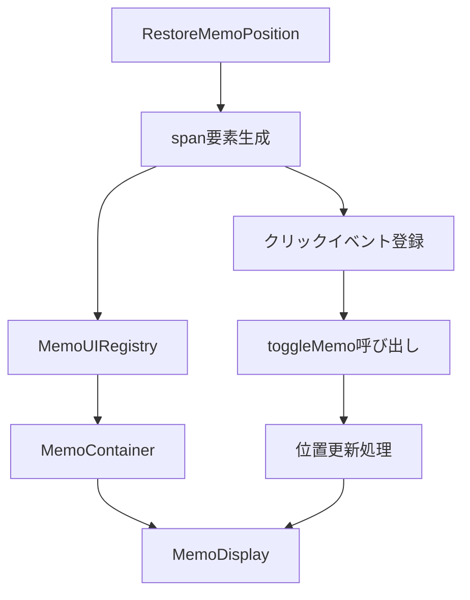

# Chrome Extension Memo System - インジケーター廃止とハイライトクリック機能

## 1. 機能概要と目的

### 実装された機能
この機能は、従来のメモインジケーター（青い小さな丸いボタン）を廃止し、選択テキストのハイライト部分を直接クリックすることでメモの表示/非表示を切り替える機能です。

### 解決される課題（コードから推測）
1. **UI要素の簡素化**: インジケーターという追加のUI要素を削除し、より直感的な操作を実現
2. **視覚的なノイズの削減**: メモがあることを示すために画面上に表示される青い丸（インジケーター）を排除
3. **操作の直感性向上**: ユーザーがハイライト部分を直接操作できることで、より自然なインタラクション
4. **位置追従の改善**: スクロールや画面リサイズ時にメモが正確にハイライト位置に追従する機能

## 2. アーキテクチャと処理フロー

### 主要コンポーネントの構成



### データフローの詳細

1. **メモ作成時**:
   ```typescript
   RestoreMemoPosition.restorePosition(restoredInfo, memo.id)
   ```
   - テキスト選択位置にspan要素を生成
   - span要素に`data-memo-id`属性とクリックリスナーを設定
   - MemoUIRegistryにspan要素を登録

2. **UI表示時**:
   ```typescript
   MemoContainer → MemoDisplay
   ```
   - MemoContainerがトグルハンドラーをレジストリに登録
   - MemoDisplayが位置更新関数をレジストリに登録
   - 動的位置計算でspan位置に正確にメモを配置

3. **ユーザー操作時**:
   ```typescript
   span.click → MemoUIRegistry.toggleMemo → handleToggle → setIsVisible
   ```
   - ハイライトクリックでトグル処理を実行
   - `requestAnimationFrame`で位置更新を非同期実行

### 技術的な実現方法

**MemoUIRegistry（新規追加）**:
- 3つのMapを使用したレジストリパターン
- `memoId`をキーとしたトグルハンドラー、span要素、位置更新関数の管理
- 疎結合な設計でDOM操作とReactコンポーネントを連携

**動的位置計算システム**:
- `calculatePositionFromRect`ヘルパー関数で位置計算を統一
- スクロール位置を考慮した絶対座標計算
- `getBoundingClientRect()`とスクロールオフセットの組み合わせ

## 3. 機能仕様とユースケース

### 正常系の動作

1. **メモ作成**:
   - ユーザーがテキストを選択してメモ作成
   - 選択範囲が黄色のハイライト（span要素）で囲まれる
   - メモUIが選択位置の直下に表示される

2. **メモ表示切り替え**:
   - ハイライト部分をクリック → メモが非表示
   - 再度ハイライトをクリック → メモが表示
   - スクロールしても正確な位置に表示される

3. **位置追従**:
   - 画面スクロール時: `scroll`イベントで自動位置更新
   - ウィンドウリサイズ時: `resize`イベントで自動位置更新

### チラつき防止機能

```typescript
opacity: isPositionReady ? 1 : 0,
transition: isPositionReady ? 'opacity 0.15s ease-in' : 'none'
```

- 初期表示時は`opacity: 0`で非表示
- 位置計算完了後に`opacity: 1`でフェードイン
- 0.15秒のスムーズなアニメーション

### エラーハンドリング

1. **span要素が見つからない場合**:
   - fallbackとして`selectionInfo.boundingRect`を使用
   - `isPositionReady`を`true`に設定して表示継続

2. **位置更新失敗時**:
   - `updateMemoPosition`が`false`を返す
   - 現在位置でメモ表示を継続

## 4. 設定・管理・運用方法

### 開発者向け設定項目

**デバッグ情報の確認**:
```typescript
console.log('復元結果:', { success, restoreInfo });
```

**重要な設定値**:
- ハイライト色: `backgroundColor: '#ffeb3b'`（黄色）
- z-index: `1000`（メモ表示用）
- トランジション時間: `0.15s`

### トラブルシューティング

1. **メモが表示されない場合**:
   - ブラウザコンソールで`MemoUIRegistry`の状態確認
   - `data-memo-id`属性が正しく設定されているか確認

2. **位置がずれる場合**:
   - `getBoundingClientRect()`の値とスクロール位置を確認
   - `calculatePositionFromRect`の計算結果を検証

3. **クリックが効かない場合**:
   - span要素の`cursor: pointer`スタイルが適用されているか確認
   - イベントリスナーが正しく登録されているか確認

## 5. 技術的詳細（開発者向け）

### 主要なソースコード構成

**新規追加ファイル**:
- `src/features/memo/memoUIRegistry.ts` (52行)
  - レジストリパターンの実装
  - 3つのMapによる状態管理
  - 非同期位置更新処理

**大幅変更ファイル**:
- `src/features/memo/memo.tsx` (~150行の変更)
  - `MemoIndicator`コンポーネントの完全削除
  - 動的位置計算とチラつき防止機能の追加
  - レジストリ連携機能の実装

**機能拡張ファイル**:
- `src/features/memo/restoreMemoPosition.ts`
  - `memoId`パラメータの追加
  - クリックイベントハンドラーの実装
  - レジストリ登録機能の追加

### 他機能との依存関係

1. **テキスト選択機能**: `TextSelectionInfo`型への依存
2. **メモ保存機能**: `MemoData`、`MemoPosition`型への依存
3. **復元アルゴリズム**: `RestoreMemoPosition`クラスとの密結合

### パフォーマンス考慮点

1. **イベントリスナー最適化**:
   ```typescript
   window.addEventListener('scroll', handleUpdate, { passive: true });
   ```
   - `passive: true`でスクロールパフォーマンス向上

2. **非同期位置更新**:
   ```typescript
   requestAnimationFrame(() => {
     this.updateMemoPosition(memoId);
   });
   ```
   - DOM更新タイミングの最適化

3. **メモリリーク防止**:
   ```typescript
   MemoUIRegistry.cleanup(memoId);
   ```
   - コンポーネントアンマウント時の適切なクリーンアップ

## 6. 改良の余地と今後の検討事項

### コード品質の改善点

1. **MemoUIRegistryの複雑性**:
   - 3つのMapを管理する設計は複雑
   - 単一のMapで`{ toggle, span, updatePosition }`を管理する方が効率的

2. **型安全性の向上**:
   ```typescript
   // 現在の実装
   document.querySelector(`span[data-memo-id="${memoId}"]`) as HTMLElement
   
   // 改善案
   const spanElement = document.querySelector(`span[data-memo-id="${memoId}"]`);
   if (!(spanElement instanceof HTMLElement)) return null;
   ```

3. **エラーハンドリングの強化**:
   - DOM操作の失敗ケースに対する包括的な対応
   - ユーザーフィードバック機能の追加

### パフォーマンスの最適化

1. **イベントリスナーの統合**:
   - 複数のスクロール/リサイズリスナーを単一のグローバルハンドラーに集約
   - デバウンス処理の導入

2. **位置計算の最適化**:
   - `getBoundingClientRect()`の呼び出し頻度削減
   - Intersection Observer APIの活用検討

### ユーザビリティの向上

1. **視覚的フィードバック**:
   - ハイライトのhover効果追加
   - クリック可能であることの明示

2. **アクセシビリティ対応**:
   - キーボード操作のサポート
   - スクリーンリーダー対応

この実装は、UI簡素化とユーザビリティ向上という目的を技術的に適切に実現していますが、上記の改善点を検討することで、より堅牢で保守性の高いシステムに発展させることができます。
