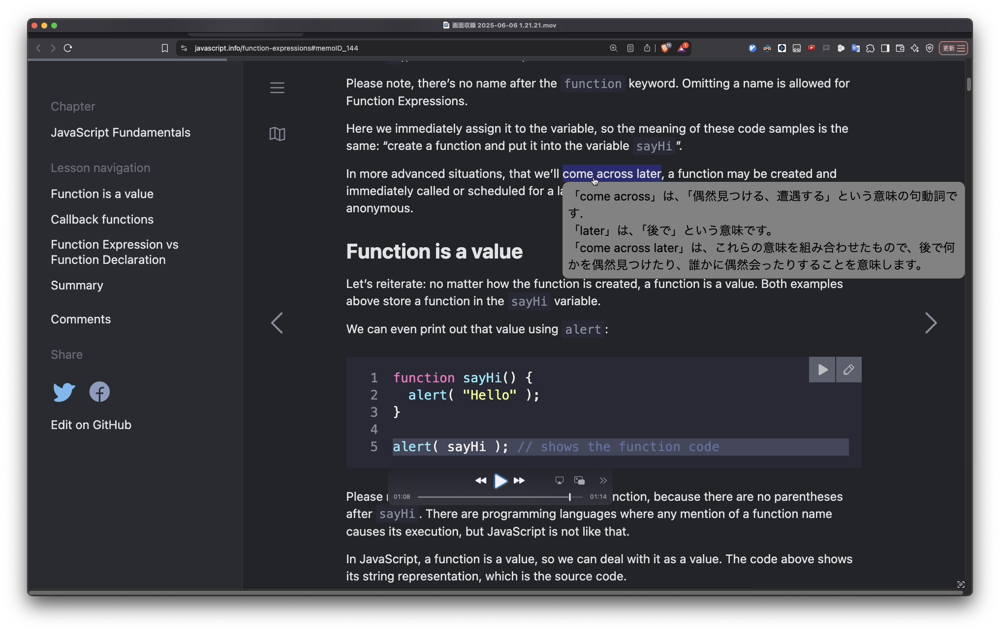

chrome拡張機能でwebサイトのテキストの部分に対してメモを作成し、それを管理したりするアプリケーションを作成したいと考えている。
最初の概念を理解してもらうためにじっくりと仕様を練り上げようと思う。以降、開発しようとしているchrome拡張機能について、「この拡張機能」と称す。

現状は2.以降は途中書きである

1. webサイト上のメモ
主にchrome拡張機能でいう、contentの領域で処理するものだと思う。

    1.1 概要
    webサイト上にメモを付与して、自分がその時に思ったこと、また、今後の理解を助けるような情報をサイト上にメモとして記す。
    
    - ここでいうメモというのは画像に示す、灰色の矩形の要素である。
        - メモには「come across」は、↓の内容が書かれている。（画像を認識すればわかると思うが）
        ```txt
        「偶然見つける、遭遇する」という意味の句動詞です。
        「later」は、「後で」という意味です。
        「come across later」は、これらの意味を組み合わせたもので、後で何かを具然見つけたり、誰かに偶然会ったりすることを意味します。
        ```
    - このメモは以下の機能を持つ
        - 文章の編集
            - plainテキストもしくはmarkdownによって記述、表示が可能
        - メモの色の変更
        - タグ付け

    1.2 webページでのメモの作り方
    メモの作り方を説明する。

    1. メモはサイト上の文字列に対してドラッグにより選択する
    2. その部分に対して、右クリックメニューから「メモを作成」というこのchrome拡張機能の項目を選択する
    3. その文字列の箇所（位置）に対してメモが作成される。

    このようにしてメモが作成され、以降、このメモに気になった点や理解を助ける文章などを記入する。

    
    1.3 webページ上のメモの管理
    1.2においてwebページ上でのメモの作成方法を述べた。この拡張機能ではwebページ上にメモを作成するだけではなく、再度そのページに訪れた際に、以前作成したメモを即座に復元し、メモを見ることができるようにする。
    この時、メモの復元にあたって、過去に作成したメモがwebページ上のどの位置に復元すべきかのロジックについては検討の余地がある。現状では、メモを作成する時点で、そのメモが作成された位置を周辺のdomの内容をもとに取得しておき、それを再度webページに訪れた際にdomを解析して復元する位置を特定する、ということを考えていた。
    今のところはこの方式で行おうと考えている。
    
    1.4 メモの管理
    作成したメモの管理についてはとりあえず、chrome.storageAPI（chrome.storage.local/syncとかのやつ）を用いて、`Storage/Extension storage/この拡張機能のストレージ`のところに保存しようと思う。
    今後はapiを用いて外部のストレージなどを利用するかもしれないが、現状は上記の方針で行う。
    1.3の復元の際はこのストレージからメモの情報を取得する。

2. メモ一覧の管理の画面
chrome拡張機能が提供するページであり、ここで過去に作成したメモについて確認・編集などが行える。

3. ポップアップ
